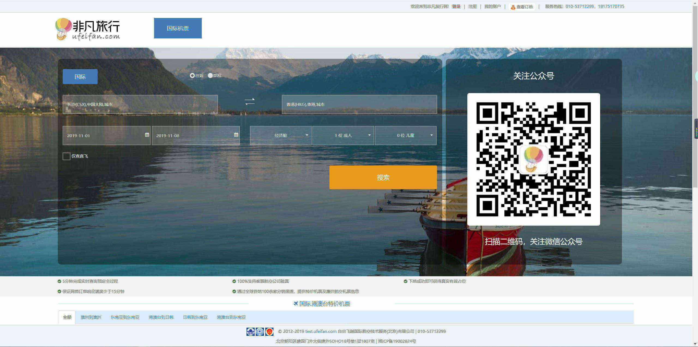
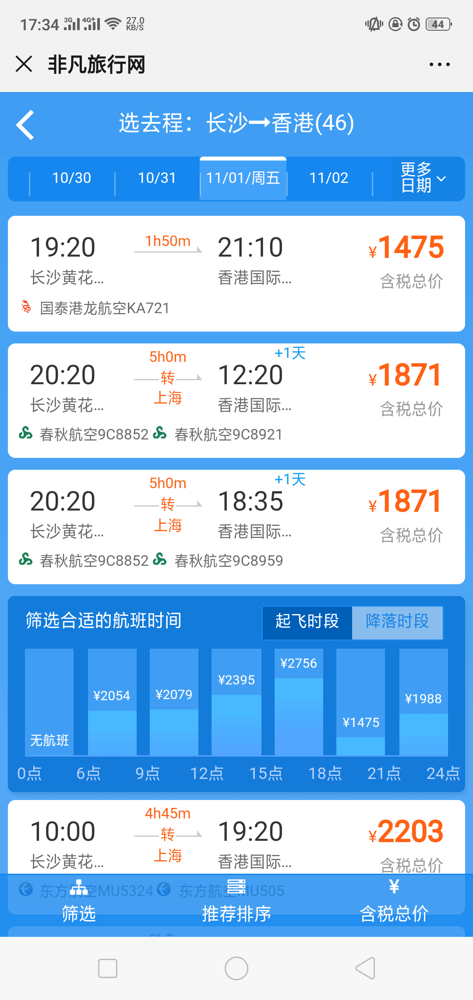
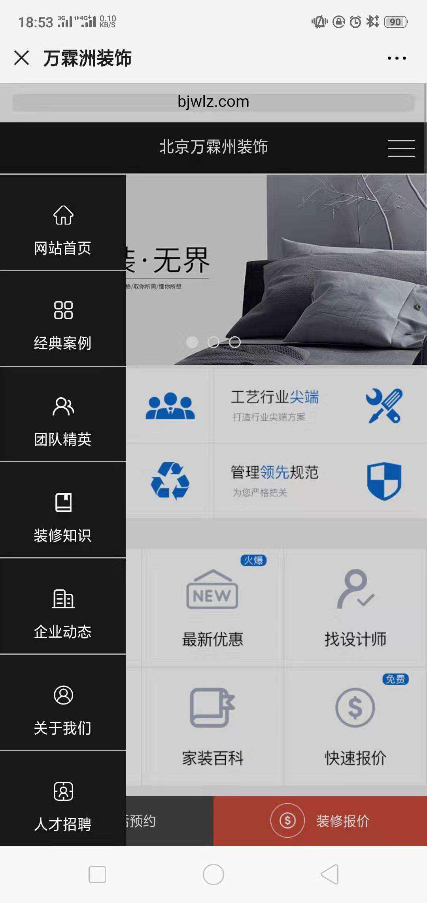
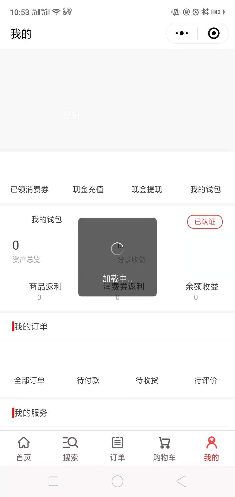
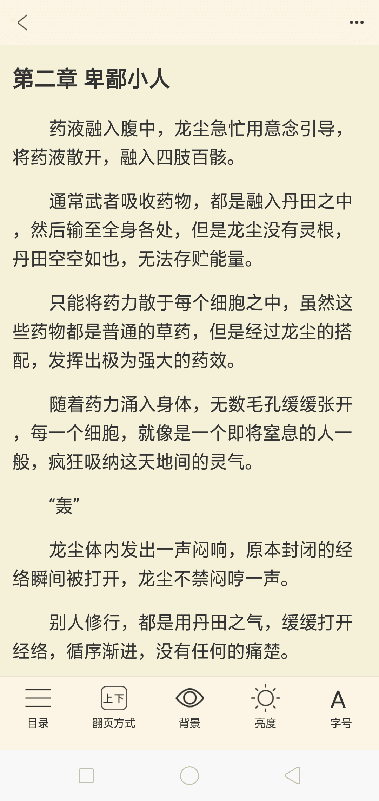
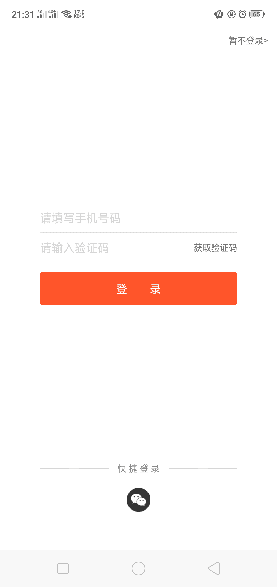

# 项目介绍

## 自由飞越国际航空技术服务有限公司

#### 公司技术文档网站（pc端）
+ 网页地址：[http://freswork.trafree.com/api/index](http://freswork.trafree.com/api/index)
+ 项目简介：演示公司前端框架各个api的用法与案例。让新入职的前端同事，能够快速上手公司所用技术栈。
+ 技术组成：require.js + Bootstrap + jQuery + font awesome等；
+ 我的职责：参与大部分的api文档编写
+ 截图预览：

#### Trafree平台和总控（pc端）
+ 项目简介：B2B机票交易平台与后台管理系统，该项目需求一直持续的增加，项目复杂程度很高；技术栈也在不断的更新换代，从开始的前后端未分离用Freemarker等的模式，到EasyUI，再到Bootstrap、require.js、gulp这些；
+ 技术组成：require.js + fis3 + gulp + Bootstrap + jQuery系列 + EasyUI + airTemplate + Font awesome + Freemarker等；
+ 我的职责：日常开发与维护、解决技术难点
+ 截图预览：
   + 平台：
   + 总控：

#### ufeifan开发与重构（pc端与移动端）
+ 网页地址：
    + pc端：[http://test.ufeifan.com/](http://www.ufeifan.com/)
    + 移动端：[https://m.ufeifan.com/](https://m.ufeifan.com/)
+ 项目简介：B2C机票交易平台，类似携程、去哪儿的机票预订平台，分为pc端和移动端。其中pc端只重构了部分的页面，移动端项目进行了整体重构。
    + pc端：兼容至ie8、以jQuery为主、拥有较多机票业务复用组件、由前后端未分离，转向前后端半分离
    + 移动端：以vue为主、webpack脚手架从0到1搭建、拥有较多移动端机票业务复用组件，如：日期选择、日历选择、机场城市选择、国籍选择等等；
+ 技术组成：
    + pc端：jQuery + artTemplate + 原生js等；
    + 移动端：webpack + vue + axios + 原生js + rem等；
+ 我的职责：
    + pc端：日常开发与维护、部分页面重构、组件封装、性能优化
    + 移动端：项目重构、脚手架搭建、组件封装、规划项目交互与用户体验等
+ 截图预览：
    + pc端：
        + 
        + 
        + 
        + 重构页：
        + 重构页：
        + 重构页：
        
    + 移动端：
        + 
        + 
        + 
        + 
        + 
        + 
        + 
    + 我封装的组件：
        + 
        + 
        + 
        + 
        + 
        + 
        + 

## 天天趣淘科技（深圳）有限公司

#### 万霖洲装饰（pc端与移动端）
+ 网页地址：http://www.bjwlz.com/
+ 项目简介：为老板朋友公司做的企业官网，分为pc端与移动端，该网站主要以UI与特效为主。
+ 技术组成：jQuery等；
+ 我的职责：独立开发
+ 截图预览：
   + pc端：
   + 移动端： 
        + 
        + 

#### 京尚品（小程序，已废弃）
+ 项目简介：购物商城、京东合作项目、以mpvue为主、整个小程序分为商品、分类、购物车、订单、钱包、优惠券几个大模块，包含五十多个页面，业务体系【较大】、同时拥有Android ios 微信小程序三个终端、项目已经做出成品，尚未上线运营，就因商务问题而放弃。
+ 技术组成：mpvue + scss等；
+ 我的职责：独立开发、代码架构、webpack脚手架扩展
+ 截图预览（由于服务端已经全部停用了，现在只能看到大致框架）：
   + 
   + 
   + 

 
#### 互动广告后台管理系统（pc端）与活动页（移动端）
+ 项目简介：一套投放广告的系统。后台管理系统分为投放明细、客户管理、媒体管理、广告位管理、数据管理、活动中心、财务管理、角色管理八大模块，技术栈以vue、element UI为主。移动端由于是活动页面，动画与DOM操作较多，单个页面体系小，技术选型用的jQuery。
+ 技术组成：
    + pc端：vue-cli + vue + element UI + vuex + axios + scss等；
    + 移动端：jQuery + Animate.css等；
+ 我的职责：独立开发等等；
+ 截图预览：
   + 

#### 书市项目（快应用端、H5端、web-app端）
+ 项目简介：围绕书市小说阅读项目的有多个端，多个渠道，以及相关管理与推广的应用。其中以快应用端为主，快应用端同时也是相对其他端，开发难度最大的一个端（官方api尚不成熟，坑比较多，当时兼容到1020平台版本）。
+ 技术组成：
    + 快应用端：快应用原生技术 + less等；
    + 其他端：uni-app + vuex + scss；
+ 我的职责：项目架构、项目成型前的业务开发、数据上报、难点开发，如：阅读器模块
+ 截图预览：
   + 
   + 
   + 
   + 
   + 
   + 
   + 
   + 
   + 
   + 
   + 
   + 
