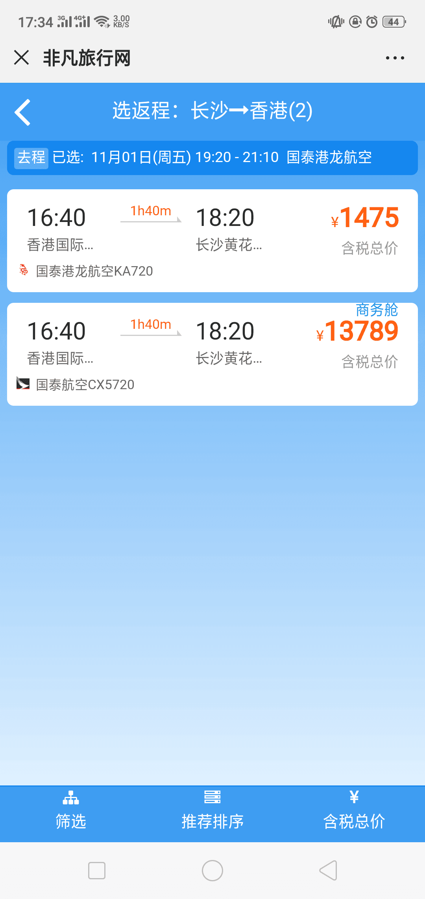
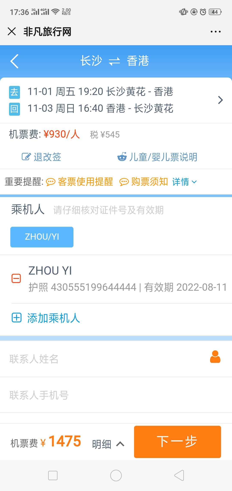
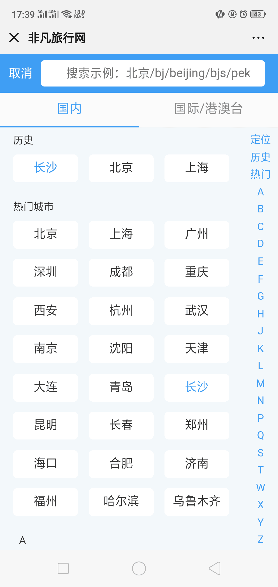
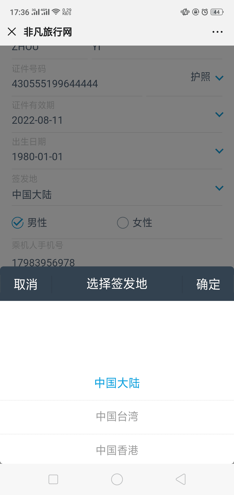

# 项目介绍

## 自由飞越国际航空技术服务有限公司

#### 公司技术文档网站
+ 网页地址：[http://freswork.trafree.com/api/index](http://freswork.trafree.com/api/index)
+ 项目简介：演示公司前端框架各个api的用法与案例。让新入职的前端同事，能够快速上手公司所用技术栈。
+ 技术组成：require.js + Bootstrap + jQuery + font awesome等；
+ 我的职责：参与大部分的api文档编写
+ 截图预览：

#### Trafree平台和总控
+ 项目简介：B2B机票交易平台与后台管理系统，该项目需求一直持续的增加，项目复杂程度很高；技术栈也在不断的更新换代，从开始的前后端未分离用Freemarker等的模式，到EasyUI，再到Bootstrap、require.js、gulp这些；
+ 技术组成：require.js + fis3 + gulp + Bootstrap + jQuery系列 + EasyUI + airTemplate + Font awesome + Freemarker等；
+ 我的职责：日常开发与维护、解决技术难点
+ 截图预览：

#### ufeifan开发与重构
+ 网页地址：
    + pc端：[http://test.ufeifan.com/](http://www.ufeifan.com/)
    + 移动端：[https://m.ufeifan.com/](https://m.ufeifan.com/)
+ 项目简介：B2C机票交易平台
+ 技术组成：
    + pc端：jQuery + artTemplate + 原生js等；
    + 移动端：webpack + vue + axios + 原生js + rem等；
+ 我的职责：
    + pc端：日常开发与维护、部分页面重构、组件封装、性能优化
    + 移动端：项目重构、脚手架搭建、组件封装、规划项目交互与用户体验等
+ 截图预览：
    + pc端：
        + 
        + 
        + 
        + 重构页：
        + 重构页：
        + 重构页：
        
    + 移动端：
        + 
        + 
        + 
        + 
        + 
        + 
        + 
    + 我封装的组件：
        + 
        + 
        + 
        + 
        + 
        + 
        + 

## 天天趣淘科技（深圳）有限公司
 
#### 互动广告 
